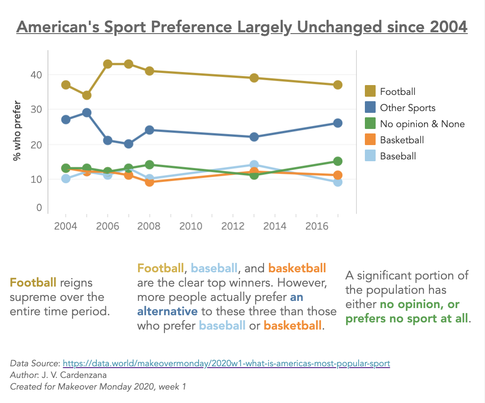

# Makeover Monday: Week 1, Jan 6, 2020
* Topic: [What is America’s most popular sport?](https://data.world/makeovermonday/2020w1-what-is-americas-most-popular-sport)
* Article: [40 maps and charts that explain sports in America](https://www.vox.com/2014/10/14/6951261/sports-maps-charts)

I approached this with the goal of visualizing the change in American's preferred sport since 2004.

