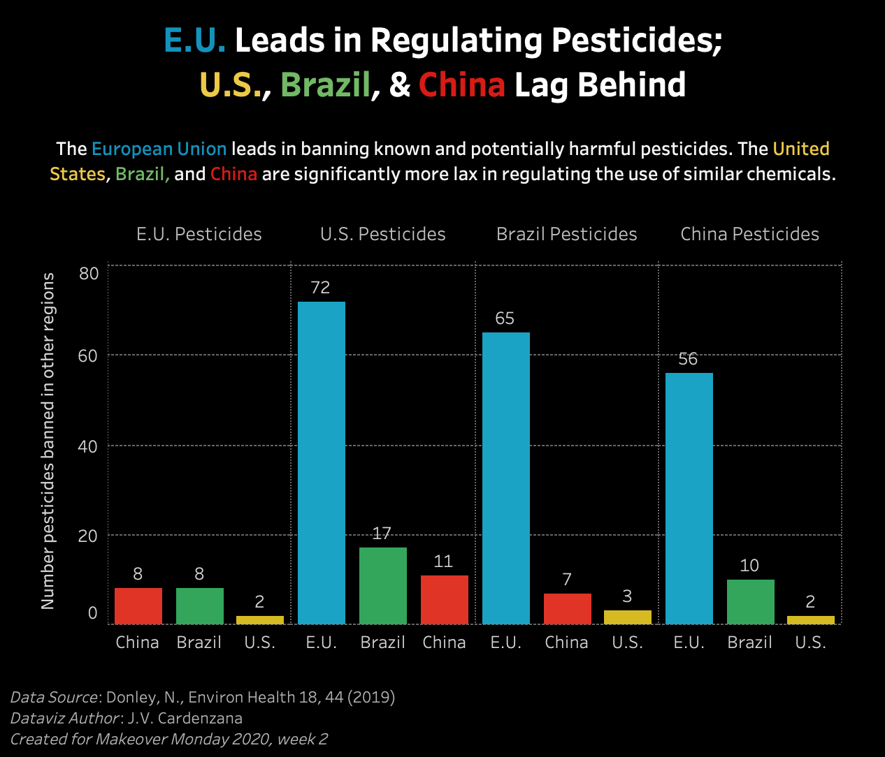

# Makeover Monday: Week 2, Jan 13, 2020
* Topic: [Pesticide use in the U.S.](https://data.world/makeovermonday/2020w2)
* Article: [The USA lags behind other agricultural nations in banning harmful pesticides](https://doi.org/10.1186/s12940-019-0488-0)

I approached this with the goal of visualizing how the European Union far surpasses the United States, Brazil, and China in regulating the use of harmful pesticides. To do that I had to extract the raw data from the original article and assemble it myself.

