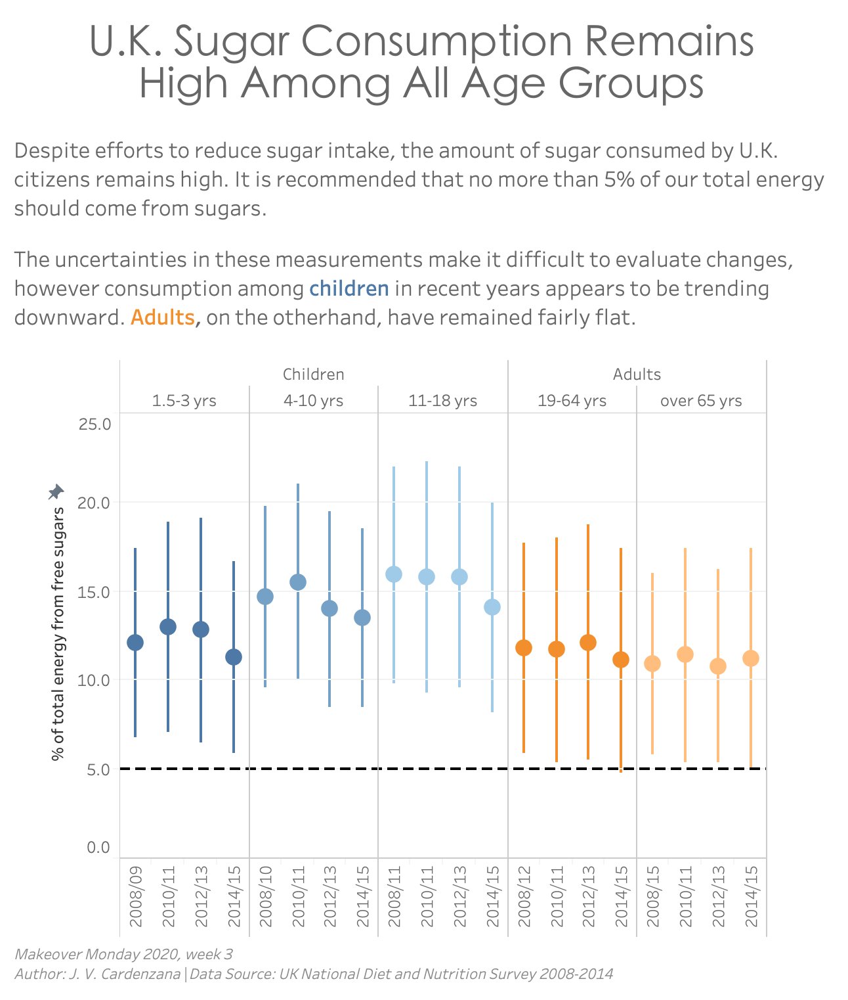

# Makeover Monday: Week 3, Jan 20, 2020
* Topic: [Sugar consumption in the UK](https://data.world/makeovermonday/2020w3-is-it-time-to-treat-sugar-like-smoking)
* Article: [Is it time to treat sugar like smoking?](https://www.bbc.com/news/health-48499195)

Many people created a visualization making the point that the consumption of sugar was going down in the UK. I wanted to make the point that the data is trending downward, but that trend isn't statistically significant. To do that I needed the errors on each measurement, which meant I had to go to the raw data.

## Making the error bars
To the best of my knowledge, Tableau doesn't provide a way to pass in data points and errors to produce an error bar chart. Instead, I had to:

1. Generate a plot consisting of a stacked bar chart with the lower and upper bounds as separate bars
2. Make the lower boundary bars white and as big as possible
3. Make a second chart with the points and all the axis labels
4. Overlay the second chart on top of the first chart

This was a bit of a pain, but I'm none the less happy with how it turned out.

