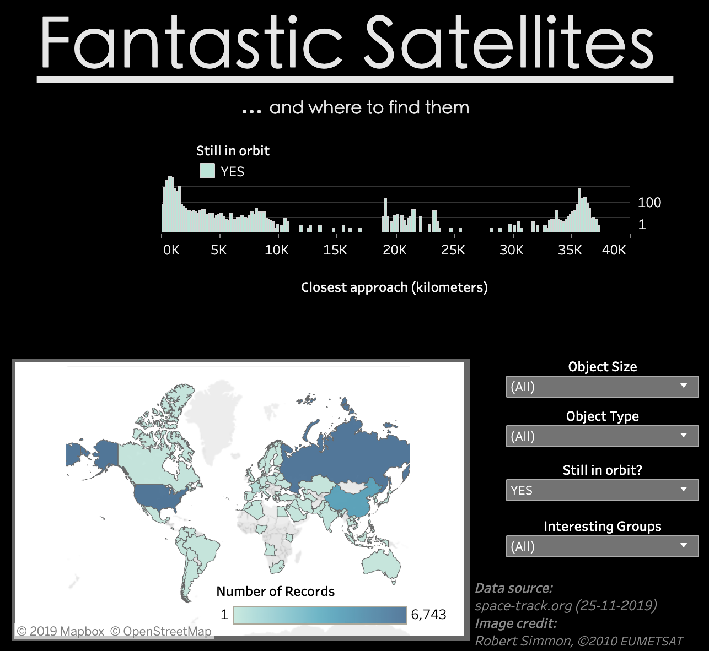

# Fantastic Satellites and Where to Find Them
This was my second major visualization with Tableau Public. It showcases all known tracked objects orbiting Earth (as of Nov 25, 2019).

When I was looking for a suitable data set for this visual, I tried a few different sites. One site looked promising, but only had data up to March and another had no easy way of downloading their data. In the end I settled on space-track.org. This site has data on all tracked objects in Earth orbit, including debris from old rockets and satellites!

This visual was my first use of drop-down selectors. I also was able to create a few interesting satellite groups:
* GPS satellites
* Starlink satellites
* Debris from the 2009 Chinese anti-satellite missile test

One thing I really like is that I scaled the image of the Earth to be consistent with the size of the 'closest approach' axis.

