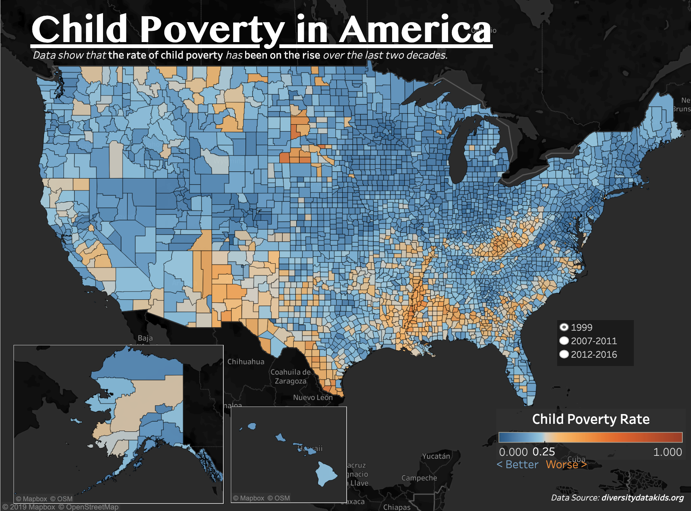

This serves as a place to document my work in visualizing child poverty in America.

## Data acquisition
The data is acquired from [diversitydatakids.org](https://www.diversitydatakids.org).

One of the issues with the data is that certain time frames have no data for some counties. However, there is always data on the state-wide average. In order to prevent large holes in the map, I've overlayed the county data on the state data.

## Preview of Dashboard
