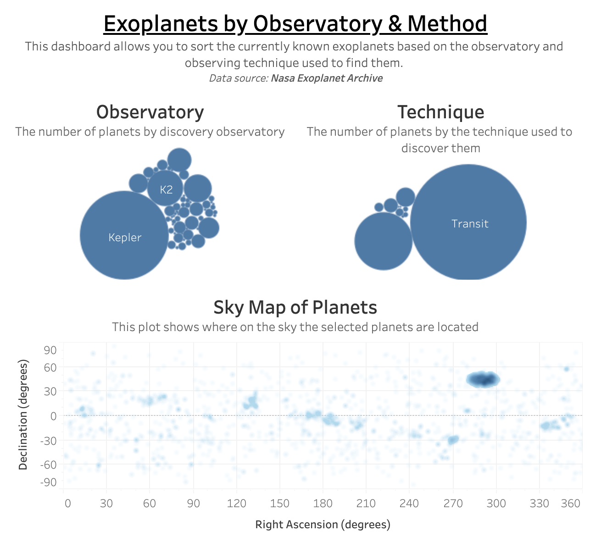

This serves as a place to document my work in visualizing exoplanet orbits.

## Data acquisition
The data is acquired using 
* [astroquery](https://astroquery.readthedocs.io/en/latest/index.html#)

From the following database:
* [NASA Exoplanet Archive](https://exoplanetarchive.ipac.caltech.edu/index.html)
* [Description of columns](https://exoplanetarchive.ipac.caltech.edu/docs/API_exoplanet_columns.html)

The following columns are kept in the final database

| Name | Description
|------|-------------
| pl_discmethod | Discovery method
| pl_orbper     | Orbital period (days)
| pl_orbeccen   | Orbital eccentricity
| pl_orbincl    | Inclination relative to line fo sight (deg)
| pl_bmassj     | Best estimate of planet mass (Jupiter masses)
| pl_radj       | Planet Radius (Jupiter radii)
| pl_dens       | Planet density (g/cm^3)
| ra            | Right ascension of planet (deg)
| dec           | Declination of planet (deg)
| st_dist       | Location of discovering instrument (Ground or Space)
| pl_facility   | Discovery instrument name

Rather than including a large file, I've instead added a jupyter notebook that 
shows how the data is downloaded and what versions of the various modules I used
and when I downloaded the data. Below you should be able to see a simple example
of what the resulting Tableau dashboard looks like.

