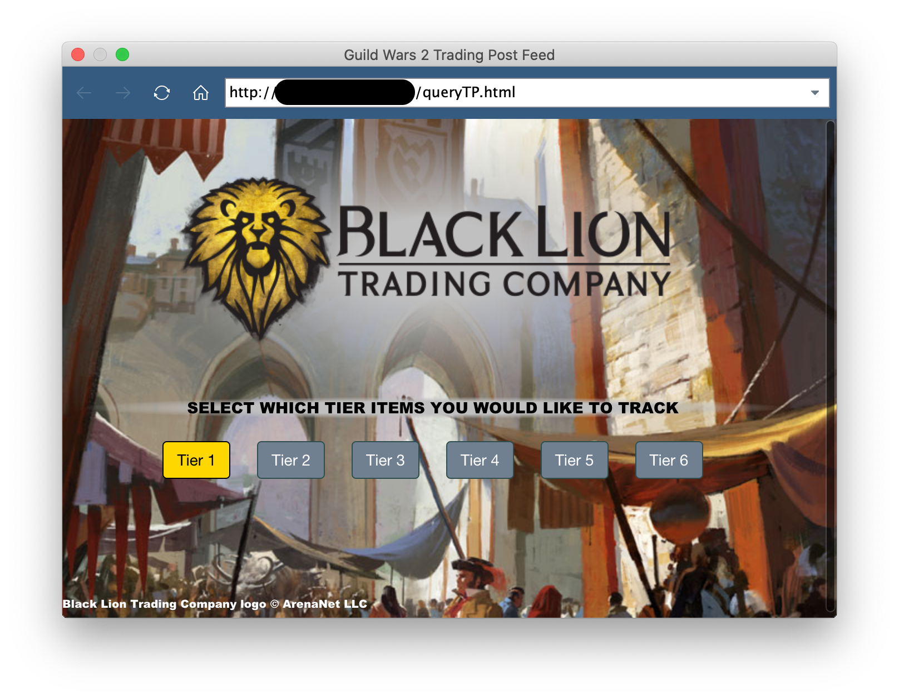
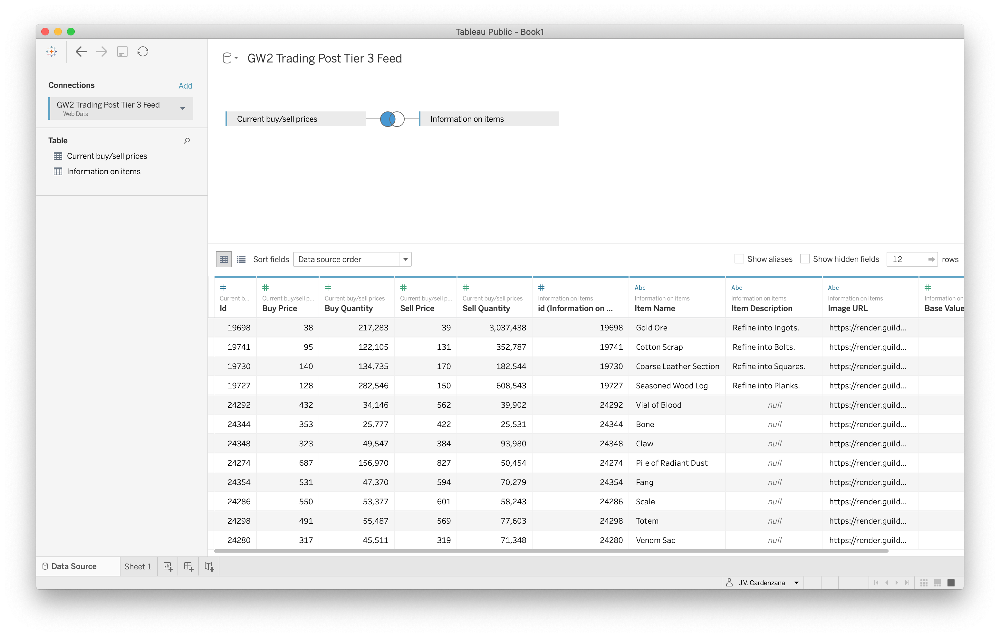

# Guild Wars 2 API Web Data Connector

[Guild Wars 2](https://www.guildwars2.com/) is a great game that I've played ever since it came out (in 2012). Being a lover of data I even used the public API to track and analyze data from the in game trading post (a place to buy and sell items) to gain some in-game wealth.

For this visualization, I want to do something I've not done before. Rather than just download a sample of trading post data and making some fun visualizations out of it, I want to create a Web Data Connector that pulls the data from the server using the GW2 API.

## Disclaimer
There's going to be a few images in this that are NOT my property. I'm only using them because it makes the visualization look better. They are the property of ArenaNet and their respective creators (and maybe NCSOFT).

## How-to: Setup the web data connection
The first thing to do is to take a look at the files in the [web_data_connector](web_data_connector/) folder. In here there are three important files and a directory:
1. `package.json`: The NPM package file
2. `queryTP.html`: The HTML file that will serve as our web data connector
3. `queryTP.js`: The javascript backend that will fetch the data that we want. Also identifies the schema for the extracted data.
4. `images/`: The images used in the GUI

If you don't want to download the entire repository then you can feel free to copy the three files to your local machine and run the following commands (the images shouldn't be necessary, they just make it look pretty):

```bash
# Install the necessary dependencies
npm install
# Start the web server locally
npm start
```
Now you'll be able to go to one of the links that the http-serving is available on.

We want to actually connect to the API and get the data, so open Tableau and select 'Web Data Connector' from the options on the left of the opening screen. This pops up a small browser. From here navigate to `http://<ip address>:8888/queryTP.html` and you should see something like:



Now if you select one of the materials tiers, it will setup the appropriate connector behind the scenes. There are two API's that are queried:
* **commerce**: Gets the current buy/sell data on the items in the selected Tier.
* **items**: Gets information about the names, descriptions, vendor sell value, and the item image URL.

You can setup a left JOIN between these two tables, click 'Update Now', and the resulting joined data will be placed into a table to be used as a data source:



Now, as we build our visualizations and dashboards, updating the underlying data is as simple as the click of a button or a quick keyboard shortcut. We could also add some javascript in that caches the data when it retrieves it so that we can track the change in values since the last update (haven't tested this, but it might work...).

## Taking things further
This demonstrates that we can get data from the game and load it into Tableau for visualization purposes. There's all kinds of ways to take this even further, but this should demonstrate how to do the bare minimum of getting data from the Guild Wars 2 API and funnel it directly into Tableau without needing something in the middle to store the data.

## A note about the API
The game has a [publicly available API](https://wiki.guildwars2.com/wiki/API:Main) that can be used to get all kinds of data: trading post queries, information on accounts, in game items, and much more.
